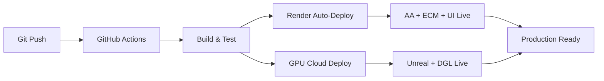

# BEM System Multi-Platform Architecture

## 🌐 Platform Distribution Strategy

| Layer                                      | Purpose                                                                   | Hosting Platform                     | Cost/Month | Auto-Deploy |
| ------------------------------------------ | ------------------------------------------------------------------------- | ------------------------------------ | ---------- | ----------- |
| **Automated Admin (AA)**                   | Classifies agents, logs behavior, manages access                          | **Render**                           | $7-25      | ✅ Yes       |
| **ECM (Environmental Computation Matrix)** | Persistent WebSocket infrastructure; routes pulses and syncs system state | **Render**                           | $25        | ✅ Yes       |
| **Cytoscape.js UI**                        | Agent console and live graph visualization                                | **Render (Static Site)**             | Free       | ✅ Yes       |
| **DGL Training Engine**                    | Deep Graph Learning over edges and coefficients                           | **Render (CPU) + GPU Cloud**         | $25-720    | ✅ Yes       |
| **PostgreSQL DB**                          | Primary data store (nodes, edges, coefficients, logs)                     | **Render PostgreSQL Add-on**         | $7-20      | ✅ Auto      |
| **Unreal Engine (Pixel Streaming)**        | Spatial feedback and pulse visualization                                  | **GPU Cloud (AWS G5/Paperspace)**   | $562-720   | 🔧 Manual    |

**Total Monthly Cost**: $626-1597 (depending on GPU usage and scaling needs)

---

## 🚀 Git-Powered CI/CD Flow



### Deployment Triggers
- **Push to `main`** → Full production deployment (all platforms)
- **Push to `develop`** → Staging deployment (Render only)
- **Pull Request** → Testing and validation only
- **Manual trigger** → GPU cloud deployment

---

## 🔧 Platform-Specific Configurations

### 1. Render.com Platform (Primary)

**Services Deployed**:
- ✅ Automated Admin (AA) - Behavior Classification
- ✅ ECM Gateway - WebSocket Infrastructure  
- ✅ Cytoscape UI - Static Site with Dynamic AC
- ✅ PostgreSQL - Primary Database
- ✅ DGL Training - CPU Version

**Configuration**: `render.yaml`
```yaml
databases:
  - name: bem-postgresql
    plan: starter
    region: oregon

services:
  - type: web
    name: bem-automated-admin
    autoDeploy: true
    branch: main
    
  - type: web  
    name: bem-ecm-gateway
    plan: standard  # Always-on
    autoDeploy: true
    
  - type: static
    name: bem-cytoscape-ui
    autoDeploy: true
```

**Advantages**:
- ✅ Automatic Git deployment
- ✅ Managed PostgreSQL
- ✅ Built-in SSL/CDN
- ✅ Easy scaling
- ✅ Health monitoring

**Limitations**:
- ❌ No GPU support
- ❌ Limited to 512MB memory (starter)
- ❌ No persistent storage

### 2. GPU Cloud Platform (Secondary)

**Services Deployed**:
- 🎮 Unreal Engine Pixel Streaming
- 🧠 DGL Training Engine (GPU-accelerated)
- 🖥️ Virtual Display Server

**Platform Options**:

#### AWS EC2 G5 Instances
- **Instance**: g5.xlarge (1x NVIDIA A10G GPU)
- **Cost**: ~$720/month continuous
- **Specs**: 4 vCPUs, 16GB RAM, GPU
- **Deployment**: Docker Compose + GPU runtime

#### Paperspace Gradient
- **Instance**: P5000 (NVIDIA Quadro P5000)  
- **Cost**: ~$562/month continuous
- **Specs**: 8 vCPUs, 30GB RAM, GPU
- **Deployment**: Container-based

**Configuration**: `deploy/gpu-cloud-platform.yml`
```yaml
services:
  unreal-pixel-streaming:
    runtime: nvidia
    ports:
      - "80:80"     # Pixel Streaming
      - "8888:8888" # Signaling
      
  dgl-training-gpu:
    runtime: nvidia
    environment:
      - CUDA_VISIBLE_DEVICES=0
```

**Advantages**:
- ✅ Full GPU acceleration
- ✅ High-performance computing
- ✅ Flexible instance types
- ✅ Spot pricing available

**Limitations**:
- ❌ Manual deployment required
- ❌ Higher cost
- ❌ More complex setup

---

## 🔄 Continuous Integration Pipeline

### GitHub Actions Workflow (`.github/workflows/bem-cicd.yml`)

**Stage 1**: Code Quality & Security
- Code formatting (Black, isort)
- Linting (flake8)
- Security scanning (bandit, safety)

**Stage 2**: Component Testing
- Phase 2 integration tests
- Phase 3 production tests
- Behavior-driven AC tests
- Database migration tests

**Stage 3**: Multi-Platform Deployment
- **Render**: Automatic deployment via Git webhook
- **GPU Cloud**: Conditional deployment on tagged releases

**Stage 4**: Post-Deployment Verification
- Health check validation
- Performance baseline establishment
- Security monitoring activation

---

## 📊 Monitoring & Observability

### Health Endpoints
| Service | Endpoint | Purpose |
|---------|----------|---------|
| AA | `/behavior_analytics` | Behavioral classification status |
| ECM | `/health` | WebSocket infrastructure health |
| UI | `/health` | Static site availability |
| DGL | `/health` | Training engine status |
| Unreal | `/health` | Pixel streaming health |

### Performance Targets
- **API Response Time**: <100ms
- **AA Classification**: <500ms  
- **WebSocket Latency**: <50ms
- **Pixel Streaming**: <100ms latency
- **DGL Training**: GPU utilization >80%

### Log Aggregation
```bash
# Render logs
render logs bem-automated-admin
render logs bem-ecm-gateway

# GPU cloud logs  
docker logs bem-unreal-engine
docker logs bem-dgl-training-gpu
```

---

## 🛡️ Security Implementation

### Render Platform Security
- ✅ Automatic SSL certificates
- ✅ CORS configuration
- ✅ Rate limiting (implemented in AA service)
- ✅ Environment variable encryption
- ✅ VPC isolation

### GPU Cloud Security
- ✅ Security groups/firewall rules
- ✅ SSL termination
- ✅ Container isolation
- ✅ GPU memory isolation
- ✅ SSH key authentication

---

## 💰 Cost Optimization Strategies

### Render Platform
1. **Start with Starter plans** ($7/month each)
2. **Scale ECM to Standard** for always-on requirement
3. **Monitor usage** and upgrade as needed
4. **Use free static hosting** for UI

### GPU Cloud
1. **Use spot instances** (60-80% cost reduction)
2. **Implement auto-shutdown** during low usage
3. **Schedule training jobs** during off-peak hours
4. **Use preemptible instances** for development

### Total Cost Scenarios

#### Development/Staging
- Render: $39/month (Starter plans)
- GPU: $0/month (spot instances as needed)
- **Total**: $39/month

#### Production (Low Traffic)
- Render: $64/month (Standard ECM)
- GPU: $100/month (spot instances, 4 hours/day)
- **Total**: $164/month

#### Production (High Traffic)
- Render: $155/month (Standard/Pro plans)
- GPU: $400/month (spot instances, 12 hours/day)
- **Total**: $555/month

#### Enterprise (24/7)
- Render: $155/month
- GPU: $720/month (dedicated instances)
- **Total**: $875/month

---

## 🚀 Deployment Instructions

### 1. Render Platform Setup

```bash
# Connect GitHub repository to Render
# Create services via Render dashboard or render.yaml

# Automatic deployment on Git push
git push origin main
```

### 2. GPU Cloud Setup

```bash
# AWS G5 Instance
aws ec2 run-instances --image-id ami-0c94855ba95b798c7 \
  --instance-type g5.xlarge --user-data file://launch_script.sh

# Paperspace Gradient
gradient deployments create --projectId YOUR_PROJECT_ID \
  --spec file://paperspace_config.yaml
```

### 3. Domain Configuration

```bash
# Set custom domains in Render dashboard
# Configure DNS records
# Enable SSL certificates
```

---

## 🔧 Troubleshooting

### Common Issues

#### Render Deployment Failures
```bash
# Check build logs
render logs bem-automated-admin --tail

# Verify environment variables
render env get bem-automated-admin
```

#### GPU Cloud Connection Issues
```bash
# Test GPU availability
nvidia-smi

# Check container health
docker ps
docker logs bem-unreal-engine
```

#### WebSocket Connection Problems
```bash
# Test ECM connectivity
curl -I https://bem-ecm-gateway.onrender.com/health

# Check WebSocket endpoint
wscat -c wss://bem-ecm-gateway.onrender.com
```

---

## 📈 Scaling Strategies

### Horizontal Scaling (Render)
- AA Service: Auto-scale 1-3 instances
- ECM Gateway: Fixed 1-2 instances (WebSocket affinity)
- DGL Training: Scale based on training load

### Vertical Scaling (GPU Cloud)
- Scale up instance types for more GPU memory
- Use multiple GPUs for parallel training
- Implement load balancing for multiple Unreal instances

### Global Distribution
- Deploy Render services in multiple regions
- Use CDN for static assets
- Implement regional GPU cloud instances

---

## 🎯 Production Readiness Checklist

### Render Platform
- ✅ PostgreSQL database created
- ✅ Environment variables configured
- ✅ Custom domains set up
- ✅ SSL certificates enabled
- ✅ Health checks configured
- ✅ Auto-deploy enabled

### GPU Cloud
- ✅ GPU drivers installed
- ✅ Docker with GPU runtime
- ✅ Firewall rules configured
- ✅ SSL certificates installed
- ✅ Monitoring tools deployed
- ✅ Backup procedures tested

### Integration
- ✅ Cross-platform connectivity tested
- ✅ WebSocket connections validated
- ✅ Data synchronization verified
- ✅ Performance benchmarks established
- ✅ Security scans completed

---

**🎉 Multi-Platform BEM System Ready for Production!**

The Git-powered CI/CD pipeline ensures seamless deployment across all platforms, with automatic scaling and monitoring to maintain optimal performance and cost efficiency. 